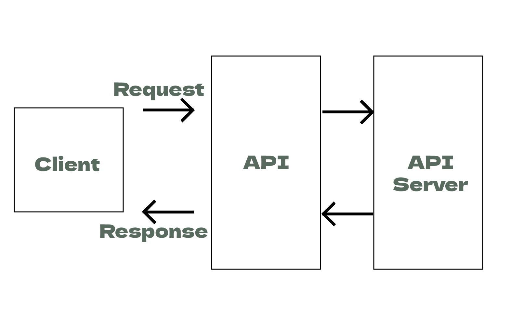

## What are APIs?
APIs (Application Programming Interface) is a way for multiple computer programs to communicate with each other.
The word "application" refers to any software with a distinct function e.g. Scripts. 
You can find more information on APIs [Here](https://aws.amazon.com/what-is/api/)
### How are they used?
For an API to work there needs to be a request made (from the user) and a response (from the API service).
Imagine a waiter in a restaurant. You, the customer, are sitting at the table with a menu of choices to order from, and the kitchen is the provider who will fulfill your order.

You need a link to communicate your order to the kitchen and then to deliver your food back to your table. It can’t be the chef because they’re cooking in the kitchen. You need something to connect the customer who’s ordering food and the chef who prepares it. That’s where the waiter — or the API —  enters the picture.

The waiter takes your order, delivers it to the kitchen, telling the kitchen what to do. It then delivers the response, in this case, the food, back to you. Moreover, if the API is designed correctly, hopefully, your order won’t crash!

### Why are they so popular?
APIs are surprisingly significant in the current world as they dictate how software developers create new applications that utilize web services. 
They offer an incredible level of accessibility in a countless amount of ways. With the growth of the connected world APIs are an absolute necessity for most applications.

## The data transfer process in API communication

## What is a **REST API**?
**REST** stands for:
* **RE**presentational
* **S**tate
* **T**ransfer 

REST APIs are a style for developing application. They use a list of rules and constraints to interact with web services. REST APIs are ***Stateless***, this means that if a request is made, it needs to contain all of the information necessary to understand the request being made.
### What makes an API **REST**ful?
To make an API **REST**ful, it must adhere to the REST API principles. 
These principles are as follows:
* Client-Server Architecture: The client and server are independent and interact through requests and responses.
* Statelessness: Each request from a client must contain all the information necessary to understand the request.
* Cache-ability: Responses must define whether they are cacheable or not to prevent the client from reusing outdated data.
* Layered System: Clients interact with the endpoint without knowing the underlying layers.
* Uniform Interface: A uniform way to interact with the API, typically using standard HTTP methods like GET, POST, PUT, DELETE.
### What are the REST API guidelines?
* Use Nouns for Resources: Use nouns to represent resources in the API (e.g., /users, /products).
* Use HTTP Methods: Utilize standard HTTP methods like GET, POST, PUT, DELETE to perform CRUD (Create, Read, Update, Delete) operations.
* Versioning: Consider versioning your API to manage changes and ensure backward compatibility.
* Error Handling: Provide informative error messages and use appropriate HTTP status codes.
* Security: Implement authentication and authorization mechanisms (e.g., OAuth) to secure the API.
* Documentation: Create clear and comprehensive documentation for developers to understand how to interact with the API.
* Testing: Test the API thoroughly to ensure reliability and performance.
* HATEOAS (Hypermedia as the Engine of Application State): Include hypermedia links in responses to guide clients on possible actions.

## What is HTTP?
HTTP is the foundation of the world wide web. It is used to load webpages using hypertext links. HTTP is an application layer protocol in the OSI model. (Read about the OSI model [here](https://www.cloudflare.com/en-gb/learning/ddos/glossary/open-systems-interconnection-model-osi/)) 
HTTP stands for: 
Hyper Text Transfer Protocol  
HTTPS is the secure version of HTTP. When this secure protocol is used, the data that is transferred is encrypted.

## The HTTP request structure.

* VERB - This is the HTTP request method. It is labeled as VERB because all the request methods are verbs. It is capitalised because these methods are all written in full capitals. Examples of request methods include: GET, POST, PUT, and DELETE.
* URL - This is the target URL/URI. This is the address belonging to the server you are requesting a response from.
* Version - This parameter is optional. You may choose to include the HTTP protocol version. Examples of this are HTTP1.1 and HTTP/2
* Header - The header allows for additional information to be passed between server and client such as cookies, information about the authorization token.
* Body - The message body contains the information, the request line, headers, an empty line, and the message body that is optional. While not all requests have a body, the ones that do, often use POST to deliver the payload.

## The HTTP response structure.

* Response Code - This is a status response code. These are three-digit codes issued by a server in response to a browser-side request from a client. These status codes serve as a means of quick and concise communication on how the server worked on and responded to the client's request.  Examples of status codes:
  * 200 OK: This is successful request.
  * 400 Bad Request: This is an unsuccessful request due to a client error.
  * 404 Not Found: This is an unsuccessful request, as the server cannot find the requested resource.
* HTTP Version - This shows the HTTP specification to which the server has tried to make the message comply with.
* Header - The response-header fields allow the server to pass additional information about the response which cannot be placed in the Status-Line.
* Body - The body of the response contains the actual data sent back by the server. It could be in various formats like HTML, JSON, XML, or plain text.

## The 5 HTTP verbs.
* POST - Create an item.
* GET - Retrieve a single item or a list of items.
* PUT - Update an item.
* DELETE - Delete an item.
* PATCH - Create partial modifications to a resource, making it a lightweight version of PUT.

## What is "statelessness"?
Statelessness is a key principle in the HTTP protocol. It simplifies the job of the server by having it treat each request as a unique transaction. This is important because it means the server does not have to store any session data or any information about the client.
### Examples of Stateless HTTP requests:
* HTTP GET requests: When a client sends a GET request to the server to retrieve a resource (like a webpage), it is considered stateless because each GET request is independent of any previous requests. The server processes the request based solely on the information contained in that specific request.
* RESTful APIs: Representational State Transfer (REST) APIs are designed to be stateless. Each request to a RESTful API contains all the information needed for the server to fulfill the request, without relying on previous interactions.

### Examples of Stateful HTTP requests:
* HTTP POST requests: Unlike GET requests, POST requests are often used for sending data to the server to create or update a resource. These requests can be stateful if they require the server to maintain some information about the client's session to process the request correctly.
* Session-based authentication: When a user logs into a website and maintains a session, subsequent requests that require authentication are considered stateful because they rely on the session information stored on the server.

## What is caching?
Caching is a method of improving the performance of memory. It is the process of storing copies of data in a temporary location "closer" to the user. The word closer refers to a virtual location such as within a server or browser. If a user requests a resource that is cached then it is can be loaded faster due to being stored "closer".